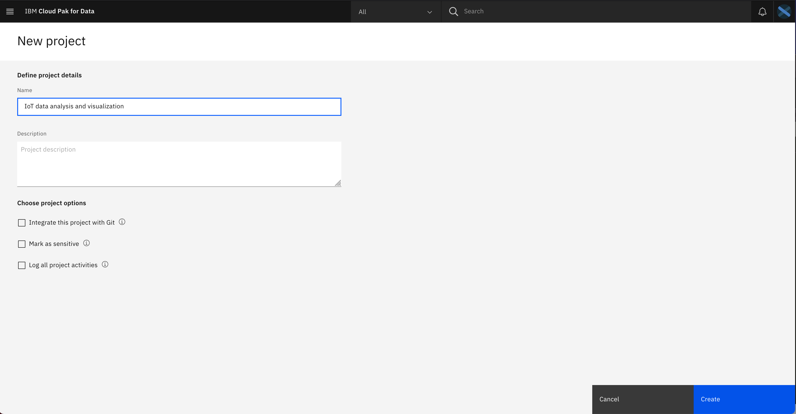

# Monitor and Analyze IoT data at your location using IBM Cloud Satellite and IBM Cloud Pak for Data

In the chemical research plant, the containers containing various chemicals under study are required to be maintained within certain threshold. In our case the minimum temperature threshold is 27°F and maximum threshold is 30°F. Correct and highly accurate temperature control is very important. If container temperatures are too low or if container temperatures are too high, the consequences could be fatal. Hence, a swift action must be taken when the container temperature crosses the defined threshold. If we were to build a solution on public cloud for this use-case, latency could be a real problem. The solution to this problem is the IBM Cloud Satellite. IBM Cloud Satellite is IBM’s new distributed cloud capability. With satellite we can take advantage of the IBM cloud services with industry optimized security and compliance with leading AI capabilities anywhere you need it.

In this code pattern, we will create a live dashboard view of temperature IoT data from chemical containers located on-premise. We will also create a monitoring and alerting application that manages automated logs and alerts of the real time IoT data. We will be using IBM Cloud Satellite to create satellite locations and attach hosts from on-premises data centres and edge network. We will then create a Red Hat OpenShift cluster that will live on the satellite location and install IBM Cloud Pak for Data on top of redhat openshift. We will use the services offered by IBM Cloud Pak for Data to build the solution for our usecase. 

<!--  -->

## Flow


1. Create a Satellite location and assign hosts using IBM Cloud Satellite.
2. Create the OpenShift Cluster that will live on your satellite location.
3. Deploy the IoT simulator application on premise.
4. Install IBM Cloud Pak for Data on the Red Hat OpenShift cluster.
5. Build a streams flow on Cloud Pak for Data for the incoming IoT data.
6. Visualize incoming IoT data using Streams service on Cloud Pak for Data.
7. Deploy IoT data monitoring and alerting application on the Red Hat OpenShift cluster.
8. Consume the IoT data from the simulator at real time.
9. Monitor the data at real time using the dashboard UI.


## Pre-requisites

* [IBM Cloud account](https://www.ibm.com/cloud/) : Create an IBM Cloud account.
* [OC CLI](https://docs.openshift.com/container-platform/4.6/cli_reference/openshift_cli/getting-started-cli.html): Download and Install OpenShift CLI tool.
* [Git Client](https://git-scm.com/downloads): Download Git Client CLI.

# Steps

Please follow the below to setup and run this code pattern.

1. [Create a Satellite location in IBM Cloud](#1-create-a-satellite-location-in-ibm-cloud)
2. [Attaching hosts from on-premises data centers and edge networks](#2-attaching-hosts-from-on-premises-data-centers-and-edge-networks)
3. [Assign hosts to the Satellite location control plane](#3-assign-hosts-to-the-satellite-location-control-plane)
4. [Create the OpenShift Cluster that will live on your satellite location](#4-create-a-red-hat-openshift-cluster-that-will-live-on-your-satellite-location)
5. [Install IBM Cloud Pak for Data on the Red Hat OpenShift cluster](#5-install-ibm-cloud-pak-for-data-on-the-red-hat-openshift-cluster)
6. [Deploy the IoT simulator application ](#6-deploy-the-iot-simulator-application)
7. [Build a streams flow and visualize incoming IoT data using Streams service on Cloud Pak for Data](#7-build-a-streams-flow-and-visualize-incoming-iot-data-using-streams-service-on-cloud-pak-for-data)
8. [Deploy the IoT data monitoring and alerting application on Red Hat OpenShift cluster](#8-deploy-the-iot-data-monitoring-and-alerting-application-on-red-hat-openshift-cluster)

### 1. Create a Satellite location in IBM Cloud.

- From the [Satellite Locations dashboard](https://cloud.ibm.com/satellite/locations), click Create location. 
- Enter a name and an optional description for your location.
- Select the IBM Cloud region that you want to use to manage your location.
- Click Create location. 

### 2. Attaching hosts from on-premises data centers and edge networks

- Hosts are machines that reside in your infrastructure In your on-premises environment, identify or create at least three host machines in physically separate racks, which are called `zones` in Satellite, that meet the [minimum hardware requirements](https://cloud.ibm.com/docs/satellite?topic=satellite-host-reqs).

- Follow the steps in this [link](https://cloud.ibm.com/docs/satellite?topic=satellite-getting-started#gs-attach-hosts-onprem) to attach hosts from on-premises data centers and edge networks. 

### 3. Assign hosts to the Satellite location control plane

- From the actions menu of each host machine that you attached, click `Assign host`.
- For the Cluster, select `Control plane`.
- For the Zone, select a unique zone such as `zone-1`.
- Click `Assign host`. 
>>NOTE: This process might take a few minutes to complete.
- Repeat these steps for each host and make sure you select unique zone, such as `zone-1`, `zone-2` and `zone-3`.
- From the Hosts tab, verify that your hosts are successfully assigned to the Satellite control plane. The assignment is successful when an IP address is added to your host and the Health status changes to Normal.

### 4. Create a Red Hat OpenShift cluster that will live on your satellite location

- Here we create the OpenShift cluster that will live on your satellite location. 

- Follow the steps in this [link](https://cloud.ibm.com/docs/satellite?topic=openshift-satellite-clusters#satcluster-create-console) to create OpenShift clusters on Satellite from the console.

- Access your OpenShift cluster on Satellite via CLI by following the instructions in this [link](https://cloud.ibm.com/docs/openshift?topic=openshift-access_cluster#access_cluster_sat)

### 5. Install IBM Cloud Pak for Data on the Red Hat OpenShift cluster

-  Follow the steps in this [link](https://www.ibm.com/support/producthub/icpdata/docs/content/SSQNUZ_latest/cpd/install/install.html) to install IBM Cloud Pak for Data on Openshift Cluster.

- We will be using watson studio, streams flow and streams services for this code pattern. Please follow below links to install respective services on Cloud Pak for Data. <br> [Watson Studio](https://www.ibm.com/support/producthub/icpdata/docs/content/SSQNUZ_latest/svc-welcome/wsl.html) <br>[Streams](https://www.ibm.com/support/producthub/icpdata/docs/content/SSQNUZ_latest/svc-welcome/streams.html)
<br>[Streams Flows](https://www.ibm.com/support/producthub/icpdata/docs/content/SSQNUZ_latest/svc-welcome/stflows.html)

> NOTE: Alternatively, you can also install [Cloud pak for data from Red Hat Marketplace](https://marketplace.redhat.com/en-us/products/ibm-cloud-pak-for-data).
If you are installing from Red Hat Marketplace, make sure you have configured the openshift cluster with RHM. More information [here](https://developer.ibm.com/tutorials/configure-a-red-hat-openshift-cluster-with-red-hat-marketplace/).

### 6. Deploy the IoT simulator application 

Since we don't have access to actual temperature sensors, we will be using an IoT Simulator for this code pattern. You can deploy this application on premise. Make sure the application has a public URL

#### 6.1. Connect to a OpenShift cluster on premise from your CLI

- To log in, you need a token which can be generated after you log in to OpenShift Cluster web console. Click the drop-down under your name in the right corner of your screen and select Copy Login Command.


- A new window will open requesting the login token details. Copy the login token. Copy the login token


- In your terminal, paste the login token. Run the command.

- You are now connected to your OpenShift cluster.

#### 6.2. Create a new project as follows,

    oc new-project <project_name>

#### 6.3. Download the `IoT data simulator application/deployment.yaml` in this repo, and run the following command

    oc  apply -f  deployment.yaml

#### 6.4. Run the following command and copy the route url 

    oc get routes -n <project_name>
   
   You will receive the following output. Copy the url path.
    
```
user@user-MacBook-Pro IoTdata % oc get routes -n iotdata 
NAME            HOST/PORT                                                                                                            PATH   SERVICES            PORT   TERMINATION   WILDCARD
iotvisual-url   iotvisual-url-iotdata.cp-dal10-b3c-xxxxxx-xxxxxxxxxxxxxxxxxxxxxxx-0000.us-south.containers.appdomain.cloud   /      iotvisual-service   8080                 None
user@user-MacBook-Pro IoTdata % 
```

#### 6.5. Test the IoT simulator app by running it using copied url in the step above on your web browser. 

You will recieve the following output,

```
{
  "container1_temperature": 27, 
  "container2_temperature": 29, 
  "container3_temperature": 27, 
  "container4_temperature": 25, 
  "container5_temperature": 30, 
  "date": "2021-05-12 11:25:43"
}
```

### 7. Build a streams flow and visualize incoming IoT data using Streams service on Cloud Pak for Data

Login into your `Cloud Pak for Data` instance that you installed in Step 4

#### 7.1  Create a project on cloud pak for data

You can complete this step by following the gif in the dropdown below or alternatively you can follow the steps described below  

<details>
<summary>GIF</summary>

</details>

- Click on the menu tab and select all projects.

- Create on `New project` tab.

- Select `Analytics project` and click on `Next`.

<!---  -->

- Select `Create an empty project`.

<!---  -->

- Give a name to the project and click on `Create`.

<!---  -->

#### 7.2 Create a Stream Flow from the IoT simulator on Cloud Pak for Data

- Navigate to the project that you created in step above and click on `Add to project`.

 <!--  -->

- Select `Streams flow`.


- Give a name to the stream and select `manually` tab as shown below. Click on `create`.


- From the `Source` tab, drag and drop `Http` and from the `Target` tab drag and drop `Debug`. Connect the source to the target as shown below,


- Paste the url that you copied in step 6.4 as shown below in the gif and edit output schema.


- Fill in the attribute names as shown below and click on `Apply`.


- You can test the stream as shown below.


- Click on `Save and run` as shown below.


- The service will take some time to build and deploy, please be patient.

- Once the deployment is completed, you will see the following output.


#### 7.3 Provision IBM Streams service on Cloud pak for Data

- As you have IBM Streams service is installed in step 5, you must now provision a Streams service instance before you can process streaming data.
- Follow the [link](https://www.ibm.com/support/producthub/icpdata/docs/content/SSQNUZ_latest/svc-streams/provision.html#provision) to provision IBM Streams

#### 7.4 Visualize the incoming IoT data

- Goto `Instances` from the menu.

- Click on the newly provisioned streams instance.

<!--  -->

- From `Streams external endpoints` click on `console` endpoint as shown below.


- Now to add widget, hover over the arrow mark and click `Create Dashboard View` as shown below.


* In `Create Data Visualisation View` enter **View Name**: ``Temperature Data monitoring`` and click `OK`.


* You can now see **Monitoring Data** table in your dashboard. Click on create line graph Button in the table as shown.


* Enter the **Chart Name**: `Data Visualization` and then click on **Categories** tab and select **container_temp** as shown below.

<p float="left">
  
   
</p>

* You can now see **Data Visualization** line graph in the dashboard.


* Similarly you can create different graphs and tables according to the need.

### 8. Deploy the IoT data monitoring and alerting application on Red Hat OpenShift cluster

- Deploy the application on redhat openshift on your satellite location. Use **`IoT data monitoring and alerting application/deployment.yaml`** yaml file for this deployment.

- Paste the url of IoT simulator application that you copied in [step 6.5](#65-test-the-iot-simulator-app-by-running-it-using-copied-url-in-the-step-above-on-your-web-browser) in the text box as shown below and click on `View my data dashboard`.


- Your data monitoring and alerting application will start monitoring and alerting.


## Summary
<!-- 
<p float="left">
  
   
</p>
-->
- In this code pattern we built visual inights using `IBM Streams` and `Streams flow` service on `IBM Cloud pak for data` and we also created a `Monitoring and Alerting application` at a `Satellite location`. You can extent the this code pattern for deriving insights and sending realtime alerts of your IoT data at your location with low latency.

- Use the AI services on **IBM Cloud pak for data** to build amazing solutions, at your location using **IBM Cloud Satellite**. More about cloud pak for data [here](https://www.ibm.com/in-en/products/cloud-pak-for-data).

<!-- keep this -->
## License

This code pattern is licensed under the Apache License, Version 2. Separate third-party code objects invoked within this code pattern are licensed by their respective providers pursuant to their own separate licenses. Contributions are subject to the [Developer Certificate of Origin, Version 1.1](https://developercertificate.org/) and the [Apache License, Version 2](https://www.apache.org/licenses/LICENSE-2.0.txt).

[Apache License FAQ](https://www.apache.org/foundation/license-faq.html#WhatDoesItMEAN)

